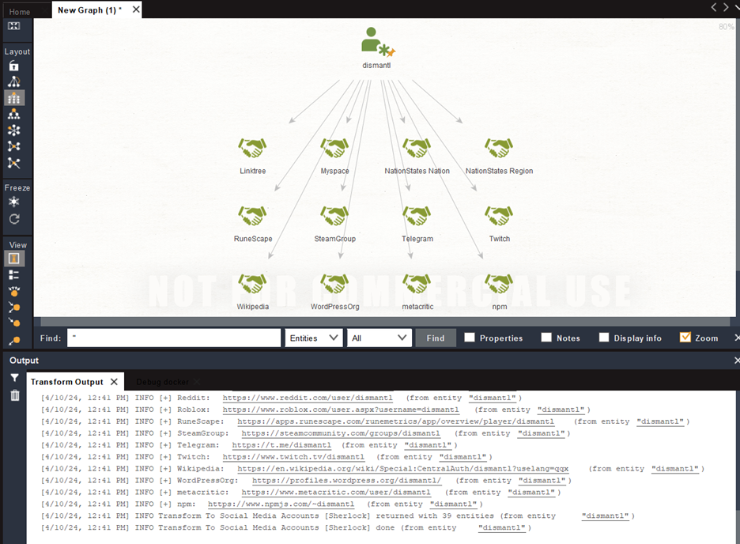
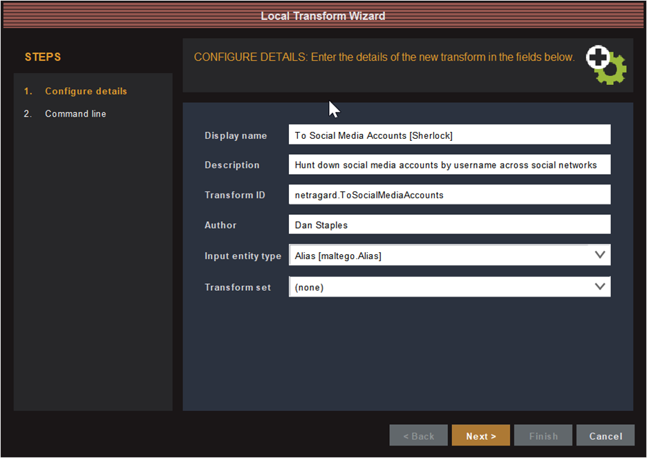
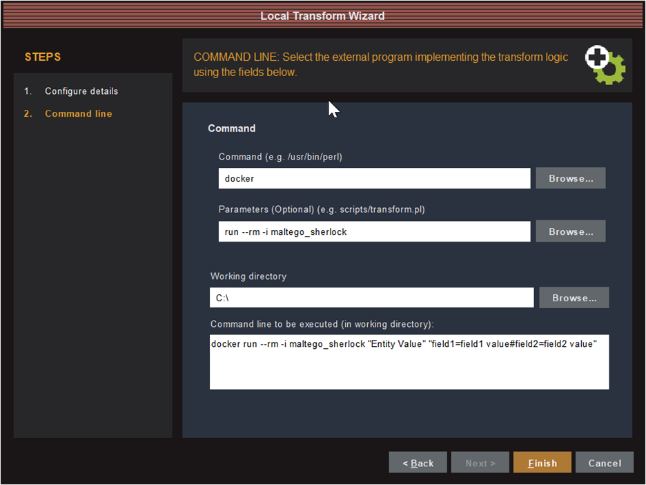

# Maltego Sherlock Transform

This repo contains a [local Maltego transform](https://docs.maltego.com/support/solutions/articles/15000034021-local-transforms) that runs [Sherlock](https://github.com/sherlock-project/sherlock) on a given username and returns the results as Affiliations.



## Adding the transform

The easiest way to run the transform locally is with Docker:

```
docker build –t maltego_sherlock . 
```

Then add the transform to your Maltego client by clicking on Transforms > New Local Transform:





To use the newly added transform, right click on the Alias entity with the username you want to look up and select `To Social Media Accounts [Sherlock]`.